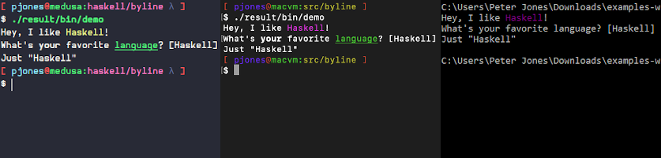

# Byline

[](https://github.com/pjones/byline/actions)
[](https://github.com/pjones/byline/releases)
[](https://hackage.haskell.org/package/byline)

Byline simplifies writing interactive command-line applications by
building upon [ansi-terminal][] and [haskeline][]. This makes it
possible to print messages and prompts that include terminal escape
sequences such as colors that are automatically disabled when standard
input is a file. It also means that Byline works on both
POSIX-compatible systems and on Windows.

The primary features of Byline include printing messages, prompting
for input, and generating custom menus. It was inspired by the
[highline] Ruby library and the [terminal library][] by Craig Roche.

## Example Using `MonadByline`

```haskell
example :: MonadByline m => m Text
example = do
  sayLn ("Hey, I like " <> ("Haskell" <> fg magenta) <> "!")

  let question =
        "What's "
          <> ("your" <> bold)
          <> " favorite "
          <> ("language" <> fg green <> underline)
          <> "? "

  askLn question (Just "Haskell")
```



## Interfaces

  * The MTL interface lives in the [`byline`](byline) directory.

  * A `fused-effects` interface is forthcoming.

[ansi-terminal]: http://hackage.haskell.org/package/ansi-terminal
[haskeline]: https://hackage.haskell.org/package/haskeline
[highline]: https://github.com/JEG2/highline
[terminal library]: https://github.com/cdxr/terminal
